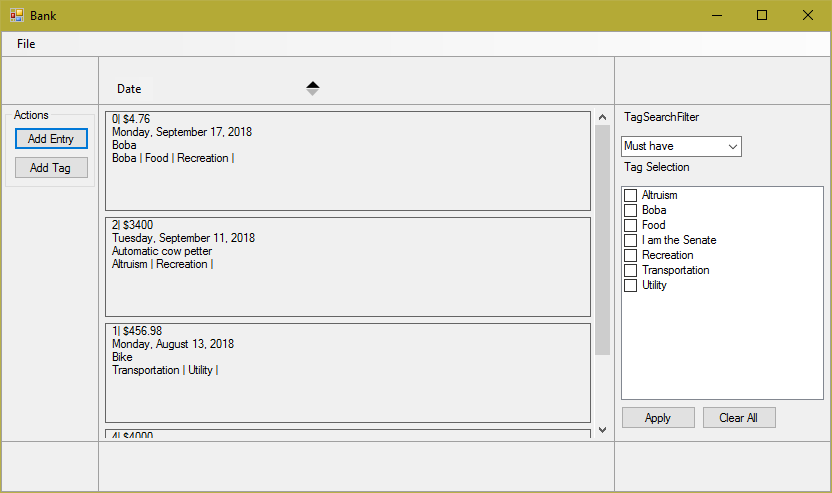
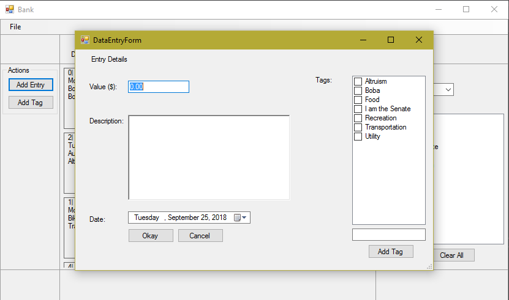

# Bank
Bank is a desktop application made with Windows Forms and C#. It is a tag based transaction recording application meant to store all your transactions for later reconciliation and look up. Every entry stores the date of the transaction, the amount of money, a description of the transaction, and any number of tags that could be associated with it. 

